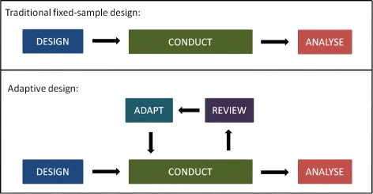
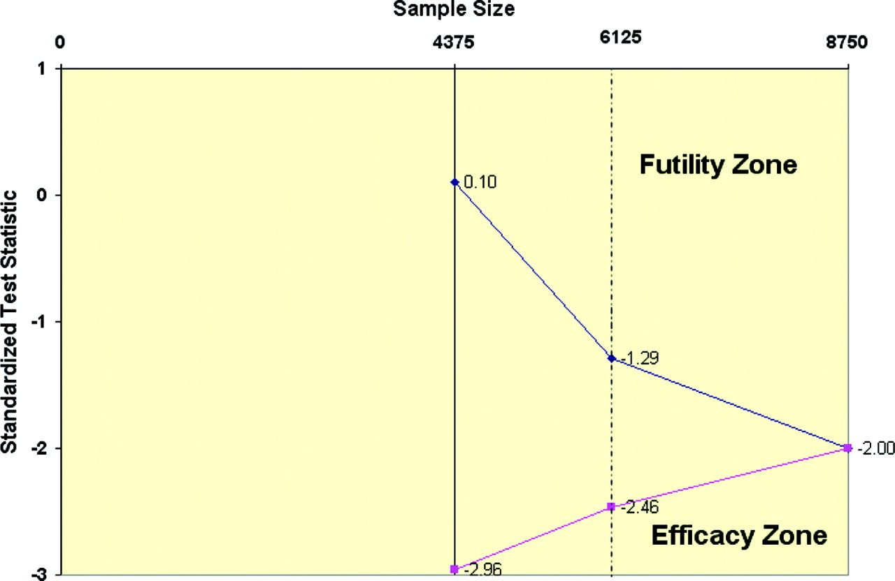
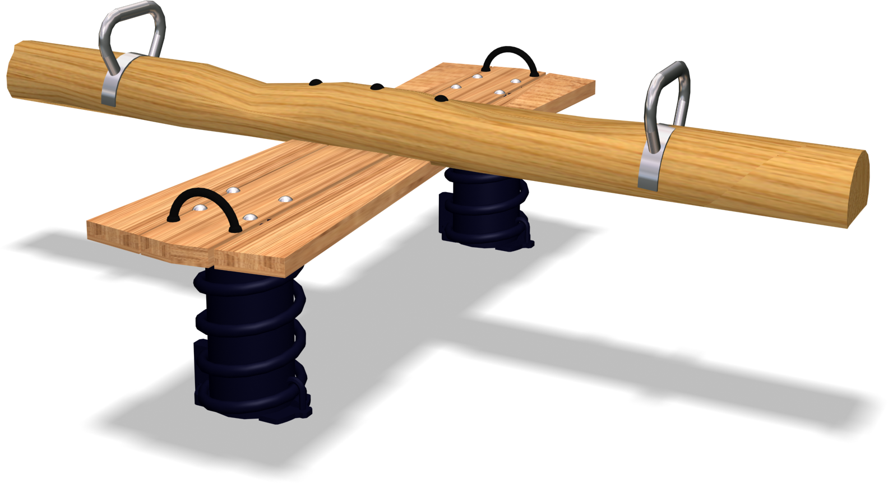
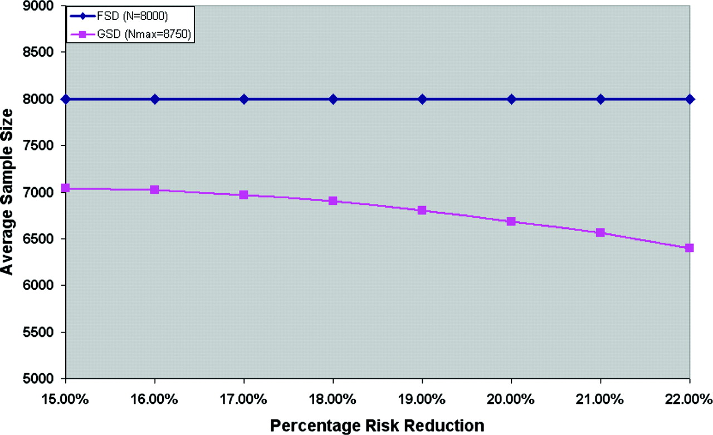
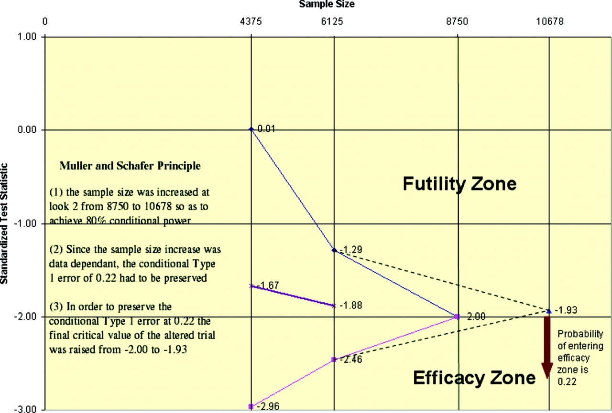
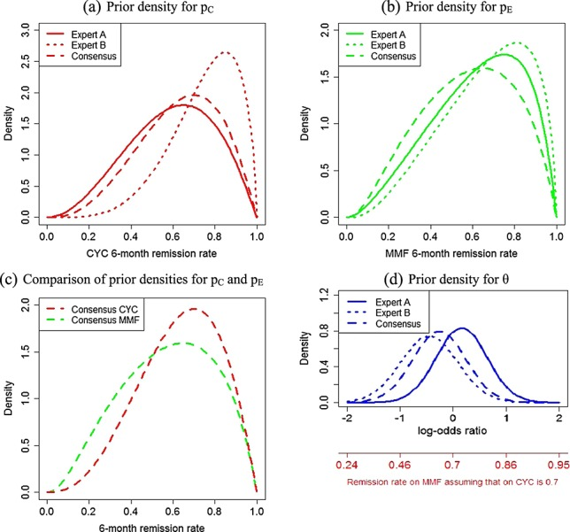
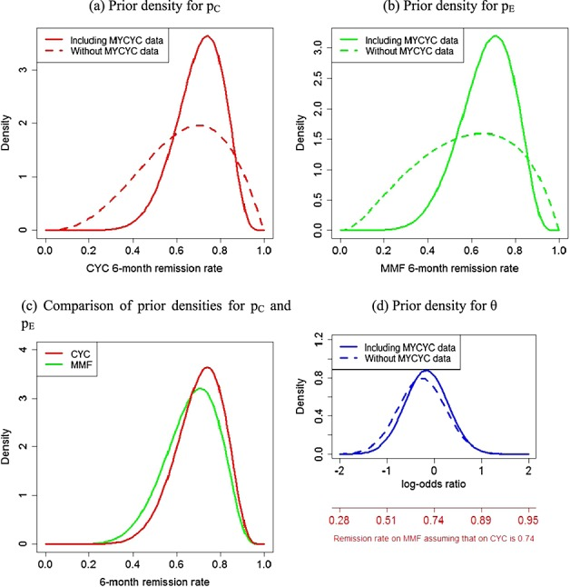
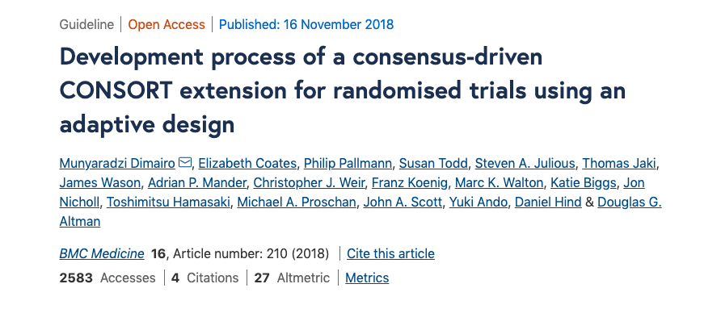

{ (Some) Bayesian Clinical Trial, Group Sequential} \(\subset\) { Adaptive Designs}
========================================================
author: Boyi Guo
date: March 5th, 2020
autosize: true

Outline
========================================================

- Intro to _Adaptive Design (AD)_
- Intro to _Group Sequential Design_
  - Sampe Size Re-estimation
- Intro to _Bayesian Clinical Trial_
  - Bayesian Clinical Trial for Very Rare Disease
- Reporting AD
- Practical Advice for ADs
- Quiz

Adaptive Design
========================================================
- What is adaptive design?
  - _pre-specified_ changes can be made based on analyses of accumulating data whilst maintaining the _validity_ and _integrity_ of the trial

    

    
    

<!--- the defining characteristics of adaptive design is --->

<!--- Comparing to the "normal" fixed design, which, the  ---->

<!--- no unplanned ad hoc modifications --->
  
 Adaptive Design
======================================================== 
- Why we want to use adaptive design?
 - _flexibility_ \(\Rightarrow\) efficient trials
  
  <!--- the main premise for adaptive design is that increase trials' flexibility and hence make the trial more efficient (less patient, faster results)--->

- When to use adaptive design?
  - used in Phase I - Phase III

Adaptive Design
========================================================  
  
- What adaptive design can do?
  - abandoning treatments or doses ( _CRM_, _E-WOC_, _multi-arm multi-stage_, _adaptive dose-ranging_ )
  - changing the allocation ratio of patients to trail arms ( _adaptive randomization_)
  - rapid transitioning between phases ( _seamless phase I/II_, _seamless phase II/III_ )
  - stopping the whole trial at an early stage for success or lack of efficacy ( __group sequential__ )
  - refining the sample size ( _sample size re-estimation_ )
  - identifying patients most likely to benefit and focusing recruitment efforts
on them ( _population enrichment_ )

  <!--- Mention: tt is possible to use a combination of the technique in one trial--->

  <!--- Transitioning sentence: The first half of the class, we will focus on the group sequential design here --->

Group Sequential Design
========================================================
- What is group sequential design
  - recruit participants by pre-planned stages (groups)
  - cumulative assessment after each stage finished using pre-planned significance levels/ critical values
  - possible early stop due to efficacy or futility
  - if not stop early, guaranteed overall type I error and power
  
<!--- Periodically examine the data according to a pre-specified plan (where periodically has been pre-planed with pre-planed significance level) to possibly make decision about the efficacy of some treatment without inflating overall type I error and losing power---->
  
Group Sequential Design
======================================================== 

  

Rationale
=========================================================
- Investigation of the trend
  - "Lowering the risk of ignoring trends and the risk of responding too quickly to trends observed in comparisons of treatment groups during the course of an ongoing trial."
  
- Review of Power/Sample Size Calculation
  - statistical test (fixed)
  - anticipated effect size
  - significance level
  - power
  - sample size
  
  <!--- varying the factors here, when the effect size is larger than anticipated, you can make decision earlier, when your effect size is too small / wrong direction, you just dont reject null --->

Rationale
=========================================================

  

Group Seuqential Design
==========================================================
- Why do we want to use it

  

Group Sequential Design
========================================================
- When to use
 - often used in Phase III, when you need a lot of participants/ money
 - focus on studying efficacy
 
- Where is the catch
  - Overall sample size is larger than that of a fixed design controling effect size, type I error and power
  - Useless when observed effect size is smaller than that assumed in the initial study design

Adaptive Sample Size Re-estimation
========================================================

- Modifying the design without inflating type I error or losing power, when if the observed effect size is smaller than anticipated effect size

  

<!--- redo the power calculation, to get a new final sample size, based on this number finding the new critical value which maintains your overall and conditional type I error--->

Adaptive Sample Size Re-estimation
========================================================
- Pandora's Box
  - possibly results a substantially larger trial to pursue effect sizes of limited clinical interest.
  - Make sure the new effect size you are powering for is still clinically important
- Really know what you are asking for!

<!--- Transitioning sentence: Adaptive Design also has its own issues need to further address. Most--->

Issues of Adaptive Design
========================================================
- Non-statistical issues
  - the possibly of introducing optional bias
  
  <!--- e.g.the interim analysis for block design to check balance--->
  
  - explaining the heterogeneity between the stages of an AD trial

- Statistical issues
  - biased estimation for effect size

  <!--- early stop for futility, biased upwards--->
  <!--- add Table 2 in adaptive design here--->

  - incorrect coverage for confidence interval
  - p-value
  - type I error rate
  - multiple hypothesis testing

<!--- Transitioning sentence
- Possible solution
  - Bayesian statistics: also report frequentest characteristics
--->

Bayesian Clinical Trial
========================================================
- What is Bayesian Clinical Trial
  <!--- Bayesian Leaning statistician-->
  -Personally, it is any clinical trial that relies on Bayesian methods for either the design or the analysis or both
- What about Bayesian statistics
  - parameter of interest is a random variable instead of an unknown constant
- How Bayesian statistics is helping
  - answer more questions: what is the probability of the parameter is within a interval?
  - sample size is a less restrictive factor in the design
  - easier to analyze accumulated data without worrying about inflating type I error
  - easier to incorporate prior information
  - incorporate decision theory
  
  
Bayesian Clinical Trial
========================================================
- What is the catch?
  - justification and documentation, specifically the choice of prior
  

  

Bayesian Clinical Trial for Rare Disease
========================================================
- Motivation:
  - incident rate is low
  - no trial to reference with
  - impossible to recruit enough people based on power & sample size calculation

Procedure
========================================================
- Decide statistical model
- Determine a prior distribution on the bases of expert opinion
- Determine prior distributions combining expert opinion with historical data
- Choice of an allocation ratio and Bayesian decision criterion

 Determine a prior distribution on the bases of expert opinion
========================================================
- Define the criteria for an "expert" and find some experts (more than 1)
- Elicit expert opinion
- Characterize expert prior opinion
- Reach the consensus

  

Determine prior distributions combining expert opinion with historical data
========================================================
- Find relevant data, and decide whether to use
- Elicit opinion on the relevance of the data
- Statistically update prior distributions with the relevant data
- Assess the impact of alternative priors 

  

Choice of an allocation ratio and Bayesian decision criterion
========================================================
 - Deciding the decision criterion in terms of probability
 - Lots of integrations

Reporting Adaptive Design
========================================================

  

  

Practical Aspects of ADs
=======================================================
- Obtain funding: convince the design is appropriate 
  - non-technical terms
  - show advantages over non-adaptive designs
  - recommending reviewer
  
<!--- other questions might be asked what you gonna do if the study stops early--->
<!--- EU and US guidelines on ADs--->

- Communicating the design to trail stakeholders/participants: 
  - independent statistical expert to confirm (stakeholders)
  - prepare a good information sheet(participants)

- Independent Data Monitoring Committee: Integrity

  - keep people with a vested interest strictly blinded to alleviate the possibility of ad hoc decisions
  
Practical Aspects of ADs
=======================================================
- Run the trial: trials are more "variable"
  - robust central system, 
  - budget more time and resource for quality control and validation 

<!--- A lot of experience about AD has been published--->
<!--- Don't re-invent the wheel. Find those giants, and step on their should hard!--->

Conclusion
========================================================
- Adaptive designs are more flexible design compared to traditional fixed-sample design
- On average, group sequential deqigns require less participants when used proporly
- Sample size re-estimation is theoretically possible if you have pre-specifed
- Bayesian clinical trial can be a solution when studying very rare design
- Reporting adaptive designs is hard
- Talk to somebody experienced when desiging adaptive studies.

Quiz
========================================================
- What is this?

  

Supplementary
========================================================

Definitions:

  - _Integrity_: "Integrity means ensuring that trial data and processes have not been compromised, e.g. minimising information leakage at the interim analyses."
  
  - _Validity_: "Validity implies there is an assurance that the trial answers the original research questions appropriately, e.g. by using methods that provide accurate estimates of treatment effects and correct p values and confidence intervals (CIs) for the treatment comparisons."
